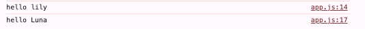
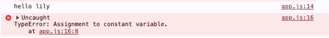
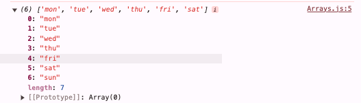
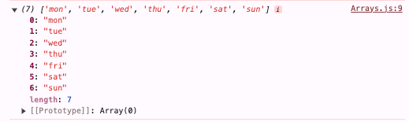
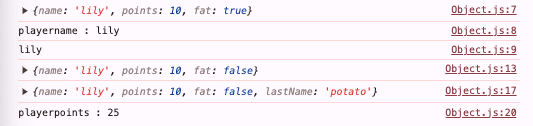

## JavaScript 1일차 학습

### 목차

> 1. [변수](https://github.com/KangJeoungMi/Study-JavaScript/blob/master/markdown/day01.md#1-변수)
> 2. [booleans](https://github.com/KangJeoungMi/Study-JavaScript/blob/master/markdown/day01.md#2-boolean)
> 3. [Arrays[배열]](https://github.com/KangJeoungMi/Study-JavaScript/blob/master/markdown/day01.md#3-arrays배열)
> 4. [Object[객체]](https://github.com/KangJeoungMi/Study-JavaScript/blob/master/markdown/day01.md#4-object객체)
> 5. [Function [함수]](https://github.com/KangJeoungMi/Study-JavaScript/blob/master/markdown/day01.md#5-function-함수)
> 6. [Return [반환값]](https://github.com/KangJeoungMi/Study-JavaScript/blob/master/markdown/day01.md#6-return-반환값)
> 7. [Conditions [조건문]](https://github.com/KangJeoungMi/Study-JavaScript/blob/master/markdown/day01.md#6-conditon-조건문)

---

### 1. 변수
> 1. `var`
> 2. `let`
> 3. `const`

#### let
- 새로운 것을 생성할 때 생기는 것
```javascript
let MyName = "lily";
console.log("hello " + MyName);

MyName = "lily colinse";
console.log("hello " + MyName);
```


#### const
- constant(상수) 값이 바뀔 수 없음
```javascript
const MyName = "lily";
console.log("hello " + MyName);

MyName = "Luna";
console.log("hello " + MyName);
```


#### var
- `var` 키워드는 1995년부터 2015년까지 모든 JS 코드에서 사용됐다.
- 2015년부터 `let` 과 `const` 가 추가되었다.
- 즉, `var` 키워드는 **이전 브라우저용으로 작성된 코드에서만 사용**해야 한다.
  - 그 외에도 스코프 문제때문이라도 `let` 과 `const` 를 사용하는게 좋다.

---

### 2. boolean
> 1. `true`
> 2. `fasle`
> 3. `null`
> 4. `undefined`

|keyword|description|
|-------|-----------|
|`true`| 참|
|`false`| 거짓|
|`null`| 비어있음|
|`undefined`| 변수에는 있지만 값이 없는 경우|
---

### [3. Arrays[배열]](https://github.com/KangJeoungMi/Study-JavaScript/blob/master/markdown/day06.md)
- 여러 자료를 묶어서 활용할 수 있는 자료구조
```javascript
const daysOfWeek = ["mon", "tue", "wed", "thu", "fri", "sat"];
console.log(daysOfWeek);
```

|mon|tue|wed|thu|fri|sat|
|---|---|---|---|---|---|
|0|1|2|3|4|5|

```javascript
// 배열 추가
daysOfWeek.push("sun");
console.log(daysOfWeek);
```

|mon|tue|wed|thu|fri|sat|sun|
|---|---|---|---|---|---|---|
|0|1|2|3|4|5|6|
---


### 4. Object[객체]
- 여러 속성을 하나의 변수에 저장할 수 있도록 해주는 데이터 타입
```javascript
const player = {
    name:"lily",
    points : 10,
    fat : true
}

console.log("player : " + player);
console.log( "playername : " + player.name);
console.log(player["name"]);

// 속성 변경
player.fat = false;
console.log("player : " + player);

// 추가
player.lastName = "potato";
console.log("player : " + player);

player.points = player.points + 15;
console.log("playerpoints : " + player.points)
```



‼️Tip
|`array`| `object`|
|-------|---------|
|설명이 필요하지 않은 데이터 리스트들| 설명이 필요한 정보가 담긴 데이터 리스트들|

---

### 5. Function [함수]
- 계속 반복해서 사용할 수 있는 코드 조각
```javascript
function 함수이름(매개변수1, 매개변수2, ...){
    console.log();
}
```
---

### 6. Return [반환값]
- 함수 실행을 종료하고 주어진 값을 함수 호출 지점으로 반환
```javascript
const age = 96;
function calKrAge(ageOfForeigner){
    return ageOfForeigner + 2;
}

const KrAge = calKrAge(age);
console.log (KrAge);

// 결과값 : 98
```
---

### 6. Conditon [조건문]

1. if 문

```javascript
// 조건문 if문
if (condition) {
    // condition === true
}if (condition2) {
    // condition2 === true
}else{
    // condition === false
}
```

## 추가
- And 연산자(모두 참일 경우에만 참 아니면 거짓) → &&
- Or 연산자(둘중 하나라도 참이면 참, 모두 거짓일때만 거짓) → ||