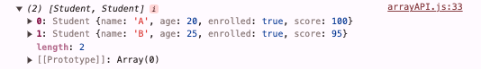

## JavaScript 로그인 폼 만들기 학습

### 목차
> 1. Array
> 2. Array API
----

### 1. Array
---

### 2. Array API
- Array(배열)과 관련된 API
#### join()
- join() 은 배열 안 데이터들을 이어붙혀 string 으로 변환할 때 사용한다.
- 파라미터로는 이어붙힐 때 들어가는 문자열이 온다.
    ```javascript
    let fruits = ['apple', 'banana', 'orange'];
    let result = fruits.join('/');
    console.log(result);
    ```
  

#### split()
- 문자열을 자를 때 사용한다. 자르는 기준값이 파라미터로 온다.
    ```javascript
    let fruits = '🫐,🍍,🍔,🍠,🍅';
    let result = fruits.split(',');
    console.log(result);
    ```
  

#### find()
- 기준에 일치하는 처음 요소만 반환한다.
    ```javascript
    class Student {
        constructor(name, age, enrolled, score) {
            this.name = name;
            this.age = age;
            this.enrolled = enrolled;
            this.score = score;
        }
    }
    
    let studentList = [
        new Student("Cristiano", 38, true, 100),
        new Student("Lionel", 36, true, 95),
        new Student("Neymar", 36, false, 90)
    ];
    
    let result = studentList.find(function (student, index) {
        return student.score === 90;
    });
    console.log(result);
    ```
  

#### filter()
- find() 와 다르게 조건에 일치하는 모든 요소를 반환한다.
    ```javascript
    class Student {
        constructor(name, age, enrolled, score) {
            this.name = name;
            this.age = age;
            this.enrolled = enrolled;
            this.score = score;
        }
    }
    
    let studentList = [
        new Student("Cristiano", 38, true, 100),
        new Student("Lionel", 36, true, 95),
        new Student("Neymar", 36, false, 90)
    ];
    
    let result = studentList.filter(student=> student.enrolled);
    console.log(result);
    ```
  

#### map()
- 배열 내의 모든 요소에 각각 함수를 적용하거나 특별한 연산을 하여 새로운 배열로 반환한다.
    ```javascript
    class Student {
        constructor(name, age, enrolled, score) {
            this.name = name;
            this.age = age;
            this.enrolled = enrolled;
            this.score = score;
        }
    }
    
    let studentList = [
        new Student("Cristiano", 38, true, 100),
        new Student("Lionel", 36, true, 95),
        new Student("Neymar", 36, false, 90)
    ];
    let result = studentList.map(student => student.score);
    console.log(result);
    ```
  
