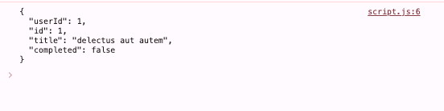
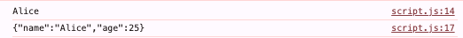
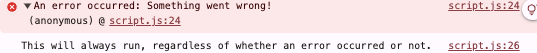
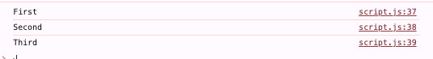
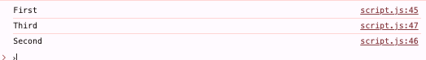
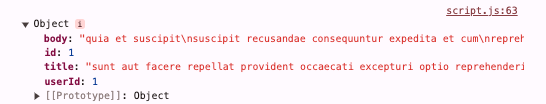
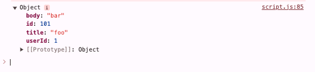

## JavaScript 로그인 폼 만들기 학습

### 목차
> 1. [AJAX](https://github.com/KangJeoungMi/Study-JavaScript/blob/master/markdown/day06.md#1-ajax)
> 2. [JSON](https://github.com/KangJeoungMi/Study-JavaScript/blob/master/markdown/day06.md#2-json)
> 3. [예외처리](https://github.com/KangJeoungMi/Study-JavaScript/blob/master/markdown/day06.md#3-예외처리)
> 4. [동기/비동기](https://github.com/KangJeoungMi/Study-JavaScript/blob/master/markdown/day06.md#4-동기비동기)
> 5. [Fetch](https://github.com/KangJeoungMi/Study-JavaScript/blob/master/markdown/day06.md#5-fetch)
----
### 1. AJAX
- `AJAX(Asynchronous JavaScript and XML)`는 웹 페이지가 전체를 다시 로드하지 않고도 서버와 통신할 수 있게 해주는 기술
- AJAX를 사용하면 웹 애플리케이션이 비동기적으로 데이터를 주고받을 수 있습니다.

#### 특징
1. 페이지를 다시 로드하지 않고도 데이터를 업데이트 할 수 있음
2. 사용자의 경험을 향상시킬 수 있음
3. 주로 `XMLHttpRequest` 객체를 사용하여 서버와 통신

```JavaScript
const ajax = new XMLHttpRequest();
ajax.open('GET', 'https://jsonplaceholder.typicode.com/todos/1', true);
ajax.onreadystatechange = function() {
  if(ajax.readyState === 4 && ajax.status === 200) {
    console.log(ajax.responseText);
  }
};
```

----
### 2. JSON
- `JSON(JavaScript Object Notation)`은 데이터를 구조화하여 저장하고 전송하는 데 사용하는 경량의 데이터 형식
- `JSON`은 사람이 읽기 쉽고, 자바스크립트 객체와 유사한 구조를 가지고 있습니다.

#### 특징
1. 키-값 쌍으로 데이터를 표현합니다.
2. 대부분의 프로그래밍 언어에서 쉽게 파싱하고 생성할 수 있습니다.
3. 웹 애플리케이션에서 서버와 클라이언트 간에 데이터를 교환하는 데 자주 사용됩니다.

```JavaScript
const jsonString = '{"name": "Alice", "age": 25}';
const jsonObject = JSON.parse(jsonString); // 문자열을 객체로 변환
console.log(jsonObject.name); // "Alice"

const newJsonString = JSON.stringify(jsonObject); // 객체를 문자열로 변환
console.log(newJsonString); // '{"name":"Alice","age":25}'
```


---
### 3. 예외처리
- 프로그램 실행 중 발생할 수 있는 오류를 처리하는 방법
- `try`, `catch`, `finally` 블록을 사용하여 예외를 처리
#### 특징
1. 프로그램이 예외 상황에서도 중단되지 않고 실행될 수 있게 합니다.
2. 디버깅을 용이하게 합니다.
3. 예상치 못한 오류를 관리할 수 있습니다.

```JavaScript
try {
    let result = riskyOperation();
    console.log(result);
} catch (error) {
    console.error('An error occurred:', error.message);
} finally {
    console.log('This will always run, regardless of whether an error occurred or not.');
}

function riskyOperation() {
    throw new Error('Something went wrong!');
}
```

---
### 4. 동기/비동기
- 코드 실행의 흐름을 제어하는 두가지 방식

#### 동기
1. 코드는 순차적으로 실행됩니다
2. 하나의 작어빙 끝날 때까지 다음 작업이 시작되자 않습니다
3. 실행 흐름이 직관적이지만, 느린 작업이 전체 프로그램을 블록할 수 있습니다
```JavaScript
function syncFunction() {
    console.log('First');
    console.log('Second');
    console.log('Third');
}
syncFunction();
```



#### 비동기
1. 코드는 병렬로 실행될 수 있습니다
2. 하나느이 작업이 완료되지 않아도 다음작업이 시작될 수 있습니다
3. 실행 흐름이 복잡하지만, 느린 작업이 전체 프로그램을 블록하지 않음
```JavaScript
function asyncFunction() {
    console.log('First');
    setTimeout(() => console.log('Second'), 1000);
    console.log('Third');
}
asyncFunction();
```

---
### 5. Fetch
> `fetch API는` 자바스크립트에서 비동기 네트워크 요청을 보내고 응답을 처리하는 현대적인 방법을 제공합니다.
> `fetch`는 프로미스를 반환하므로 비동기 작업을 처리할 때 매우 유용합니다.
> `fetch`를 사용하면 `HTTP` 요청을 보내고, 응답을 쉽게 처리할 수 있습니다.

#### 구성요소
1. `URL` : **요청을 보낼 주소**입니다. 절대 경로 또는 상대 경로를 사용할 수 있습니다._
2. `옵션` : 요청 `메서드`, `헤더`, `본문` 등을 설정할 수 있는 객체입니다._

#### 주요 옵션
- `method` : HTTP 메서드(GET, POST, PUT, DELETE 등)을 지정합니다._
- `headers` : 요청에 포함될 HTTP 헤더를 지정합니다._
- `body` : 요청의 본문을 지정합니다. 주로 POST나 PUT 요청에 사용됩니다._
- `mode`, `credentials`, `cache`, `redirect`, `referrer`, `integrity` 등의 추가 옵션도 설정할 수 있습니다._

#### 응답 처리
- `fetch`는 프로미스를 반환하며, 이는 두 가지 프로미스를 연결해 응답을 처리합니다.

1. 첫 번째 프로미스: 네트워크 요청이 완료되면 `Response` 객체를 반환합니다.
2. 두 번째 프로미스: `Response` 객체의 메서드를 호출하여 실제 데이터(json(), text(), blob() 등)를 추출합니다.

#### GET 방식
- GET 방식으로 요청할 때는 HTTP Body 를 생략할 수 있어 코드가 짧아지지만 POST 는 옵션이 많아진다.
    ```javascript
    fetch('https://jsonplaceholder.typicode.com/posts/1')
    .then(response => {
        if (!response.ok) {
            throw new Error('Network response was not ok');
        }
        return response.json();
    })
    .then(data => {
        console.log(data);
    })
    .catch(error => {
        console.error('There has been a problem with your fetch operation:', error);
    });

    ```


#### POST 방식
- POST 방식일 때는 HTTP Method , HTTP header , HTTP Body 를 옵션값을 통해 설정해줘야 한다.
  ```javascript
  fetch('https://jsonplaceholder.typicode.com/posts', {
        method: 'POST',
        headers: {
            'Content-Type': 'application/json'
        },
        body: JSON.stringify({
            title: 'foo',
            body: 'bar',
            userId: 1
        })
    })
    .then(response => response.json())
    .then(data => {
        console.log(data);
    })
    .catch(error => {
        console.error('There has been a problem with your fetch operation:', error);
    });

  ```

